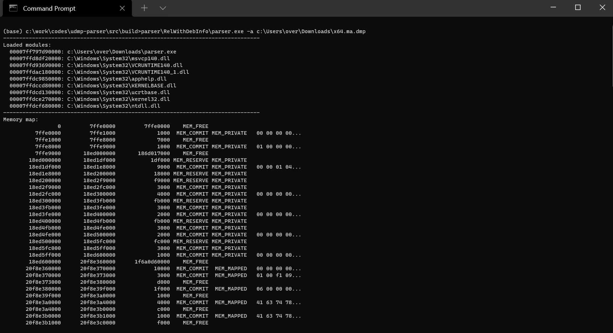
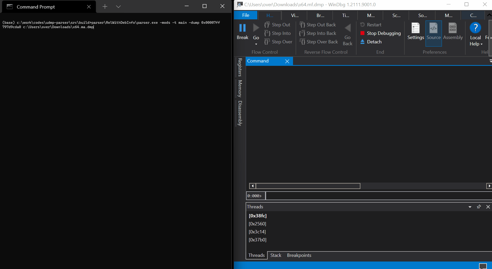

# udmp-parser: A Windows user minidump C++ parser library.

This is a cross-platform (Windows / Linux / OSX / x86 / x64) C++ library that parses Windows user [minidump](https://docs.microsoft.com/en-us/windows/win32/debug/minidump-files) dumps (`.dump /m` and **not** `.dump /f` in WinDbg usermode).

The library supports Intel 32-bit / 64-bit dumps and provides read access to things like:

- The thread list and their context records,
- The virtual memory,
- The loaded modules.

Compiled binaries are available in the [releases](https://github.com/0vercl0k/udmp-parser/releases) section.

## Parser

The `parser` application is a small utility to show-case how to use the library and demonstrate its features. You can use it to dump memory, list the loaded modules, dump thread contexts, dump a memory map various, etc.

## Building

You can build it yourself using the appropriate build script for your platform in the [build](build/) directory.

# Authors

* Axel '[@0vercl0k](https://twitter.com/0vercl0k)' Souchet
